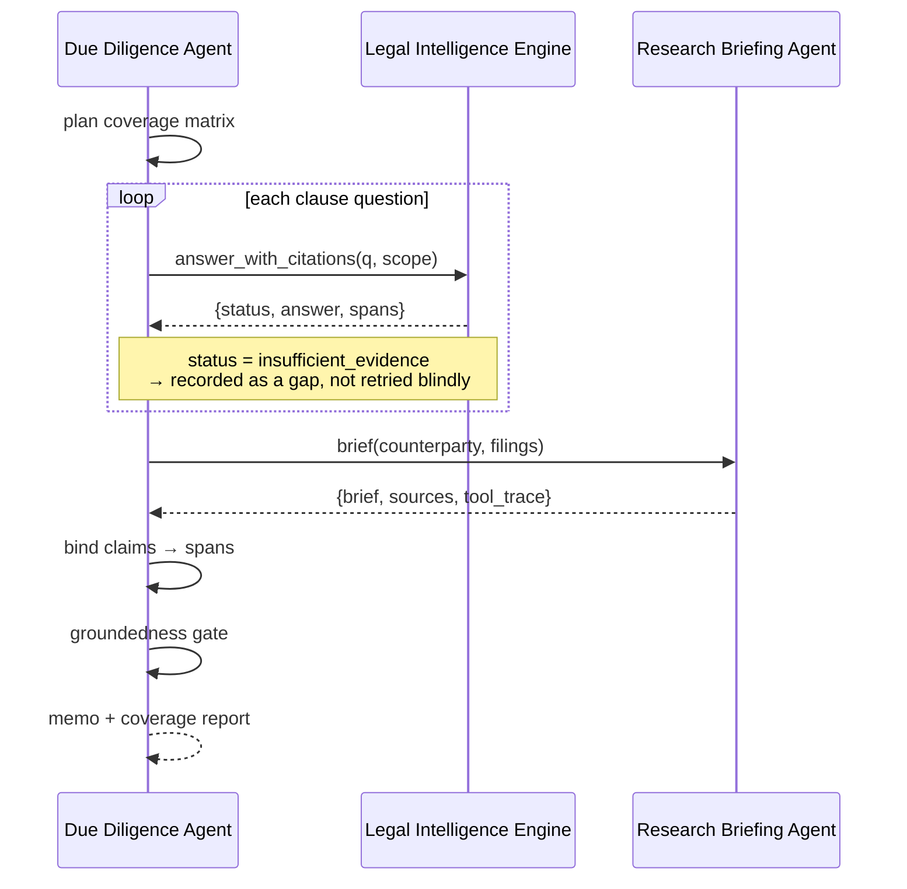
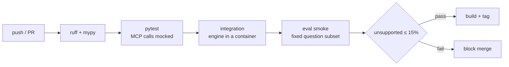

# Due Diligence Agent — *flagship*

**Reviews a document set and drafts the due diligence memo. Every claim in the output carries the span it came from.**
Composes the other two systems over MCP rather than reimplementing them.

<p>
  
  
  
  
</p>

> Part of a three-system architecture → [Legal Intelligence Engine](../legal-intelligence-engine/) · [Research Briefing Agent](../research-briefing-agent/) · [root README](../)

---

## The problem

Due diligence is not a question-answering task. It is a *coverage* task: a hundred questions asked against a document set where the expensive failure is a clause nobody asked about. Bolting an LLM onto a contract folder gets you fluent paragraphs whose provenance nobody can check — which is worse than no memo, because a memo implies review happened.

The measurable version of that failure is the **unsupported answer**: a claim in the output with no span behind it.

---

## Results

| Metric | Before tuning | After | Corpus |
|---|---|---|---|
| **Unsupported answers** | 31% | **12%** | CUAD + EDGAR |
| Cost / document | — | **~€0.023** | — |
| End-to-end latency | — | **~4.2s** | — |

Measured on a fixed benchmark set, before and after, on the same questions. Raw runs: [`evidence/eval_runs/`](evidence/eval_runs/) · definitions and sample sizes: [`../docs/METHODOLOGY.md`](../docs/METHODOLOGY.md)

**What 12% means, and does not mean.** Roughly one claim in eight still lacks a clean span binding. That is a reviewable memo, not an autonomous one — the output is built to be checked, which is why every claim ships with its source and every unsupported claim is flagged rather than silently emitted. A system that reported 0% at this sample size would be reporting its own blind spot.

---

## Architecture

```mermaid
flowchart TB
  DOC["Document set"] --> PLAN["LangGraph planner<br/>question coverage matrix"]

  PLAN -->|"MCP: answer_with_citations"| LIE["Legal Intelligence Engine"]
  PLAN -->|"MCP: brief"| RBA["Research Briefing Agent"]

  LIE --> POOL["Evidence pool<br/>claim ↔ span bindings"]
  RBA --> POOL

  POOL --> SYN["Synthesiser"]
  SYN --> GATE{"Groundedness gate<br/>claim bound to a span?"}
  GATE -->|bound| MEMO["Memo section + citation"]
  GATE -->|unbound| FLAG["Flagged: unsupported<br/>surfaced, not dropped"]

  MEMO --> OUT["Due diligence memo"]
  FLAG --> OUT

  style FLAG fill:#3a2a1a,stroke:#B8943F
  style GATE fill:#15294a,stroke:#D8B25C
```



Unsupported claims are **surfaced, not suppressed**. Dropping them would improve the headline number and destroy the memo's purpose — a reviewer needs to see where the evidence ran out.

### Composition over MCP



**Why MCP and not an import.** Retrieval is a tool the agent *selects*, not a function the script calls — the planner decides when a question needs corpus evidence versus market context. One protocol, one deployment, and a retrieval improvement in the engine reaches this agent without a release here. The cost is a protocol hop per call, which is inside the 4.2s budget.

---

## Response contract

| `status` | Condition | Memo behaviour |
|---|---|---|
| `complete` | every planned question answered, all claims bound | memo + coverage report |
| `partial` | ≥1 question returned `insufficient_evidence` | memo + explicit gap list |
| `blocked` | document set failed parsing or exceeded scope | no memo; diagnostic returned |

`partial` is the expected outcome on real document sets. A system that only ever returns `complete` is not checking.

### Sample output

```json
{
  "status": "partial",
  "memo": {
    "sections": [
      {
        "heading": "Termination",
        "claims": [
          {
            "text": "Either party may terminate for convenience on 30 days' notice.",
            "supported": true,
            "spans": [{ "doc_id": "CUAD/NDA_v3", "page": 4, "score": 0.87 }]
          },
          {
            "text": "No change-of-control restriction was located.",
            "supported": false,
            "reason": "insufficient_evidence",
            "questions_attempted": 3
          }
        ]
      }
    ]
  },
  "coverage": { "questions_planned": 42, "answered": 37, "gaps": 5 },
  "cost_eur": 0.023,
  "latency_ms": { "plan": 210, "retrieve": 1840, "synthesise": 2150 },
  "run_id": "⟨uuid⟩"
}
```

The `coverage` block is the part a reviewer reads first. It converts "the AI wrote a memo" into "37 of 42 questions have evidence, here are the 5 that don't."

---

## Design decisions

Full records in [`adr/`](adr/).

**ADR-001 — Compose over MCP rather than reimplement retrieval.**
*Alternatives:* vendor the engine as a package; duplicate the retrieval stack; call a REST endpoint.
*Chose:* MCP client against the Legal Intelligence Engine.
*Because:* three demos are three demos. One system that calls another through a standard protocol is an architecture — and the retrieval only has to be correct in one place.
*Cost:* a protocol hop per question; the engine is now a hard runtime dependency.

**ADR-002 — Coverage matrix planned up front, not agent-improvised.**
*Alternatives:* free-running ReAct agent; single mega-prompt over the document set.
*Chose:* LangGraph planner that materialises the full question set before any retrieval.
*Because:* due diligence fails by omission. An improvising agent cannot tell you what it never asked, so it cannot produce a gap list — and the gap list is the deliverable.
*Cost:* less adaptive on unusual document types; the matrix is domain-specific.

**ADR-003 — Surface unsupported claims instead of dropping them.**
*Alternatives:* suppress unbound claims; regenerate until everything binds.
*Chose:* emit them, flagged.
*Because:* suppression moves the headline metric in the right direction while making the memo less safe. Regeneration teaches the model to produce bindable-looking prose, which is the failure mode with extra steps.
*Cost:* the 12% figure is visible rather than hidden. Deliberate.

---

## Run it

```bash
git clone https://github.com/SaraDHimdi/ai-engineer-portfolio
cd ai-engineer-portfolio/due-diligence-agent

python -m venv .venv && source .venv/bin/activate
pip install -r requirements.txt
cp .env.example .env
```

The engine must be reachable first:

```bash
# terminal 1
cd ../legal-intelligence-engine && python -m src.mcp_server

# terminal 2
python -m src.review --docs samples/ --out memo.md
```

Or the whole stack:

```bash
docker compose up          # engine + agent + tracing
```

---

## Reproduce the numbers

```bash
pytest                                  # external calls mocked
python -m src.evaluate --config all     # writes evidence/eval_runs/<date>/
python -m src.evaluate --config unsupported_before_after
```

The 31% → 12% comparison runs the **same question set** against the pre-tuning and post-tuning configurations. Both configs are versioned in [`evidence/`](evidence/); neither is regenerated at read time.

**Datasets.** [CUAD](https://www.atticusprojectai.org/cuad) · [EDGAR](https://www.sec.gov/edgar). Public. Question set and gold bindings: [`evidence/qa_set.jsonl`](evidence/qa_set.jsonl).

---

## Operating envelope

| Document set | Questions planned | Wall clock | Cost | Notes |
|---|---|---|---|---|
| 1 doc | ⟨…⟩ | ~4.2s | ~€0.023 | **measured** |
| ~50 docs | ⟨…⟩ | ⟨…⟩ | ⟨…⟩ | retrieval parallelises; synthesis serialises |
| ~500 docs | ⟨…⟩ | ⟨…⟩ | ⟨…⟩ | planner batching becomes the bottleneck |
| >1000 docs | not measured | not measured | not measured | expect synthesis context, not retrieval, to break first |

Cost scales close to linearly with questions planned, not with corpus size — the engine's index is amortised across the whole set. Fill the measured rows from `evidence/eval_runs/`.

---

## Failure modes

Reproductions in [`evidence/failure_analysis.md`](evidence/failure_analysis.md).

| Failure | Cause | Mitigation | Residual risk |
|---|---|---|---|
| Unsupported claim | synthesiser asserts beyond the evidence pool | groundedness gate flags it | 12% of claims — visible, not solved |
| Coverage gap | question absent from the matrix | matrix versioned and reviewed | unknown-unknowns remain unknown |
| Cross-document conflict | engine returns `ambiguous_scope` | recorded as a gap for human resolution | the agent defers rather than decides |
| Dirty extraction | upstream parsing | none — benchmarks assume clean text | **largest unaddressed risk** |

---

## CI/CD



The gate blocks merges that raise the unsupported rate, regardless of what they improve elsewhere. Threshold versioned in [`.github/workflows/eval.yml`](../.github/workflows/eval.yml).

---

## Stack

**Orchestration** LangChain · LangGraph · LangSmith · MCP
**Retrieval** *(via the engine)* Chroma · Pinecone · Sentence Transformers
**Evaluation** RAGAS · DeepEval · Guardrails AI
**Production** FastAPI · Docker · GitHub Actions · pytest · Helicone

---

## Roadmap

1. **Drive unsupported below 12%** by widening the evidence pool before synthesis, not by suppressing claims.
2. **Coverage matrix as a reviewable artifact** — let a lawyer edit the question set without touching code.
3. **Cross-document reasoning**, so `ambiguous_scope` resolves instead of deferring.
4. **Scope 2 — French and Arabic.** Every figure above is measured on **English** corpora; the civil-law positioning is a claim, not a demonstration. → [`../docs/SCOPE-2-ARABIC-FRENCH.md`](../docs/SCOPE-2-ARABIC-FRENCH.md)

---

**Demo:** ⟨link⟩ · MIT licensed
*Built with intention. Measured before it ships.*
