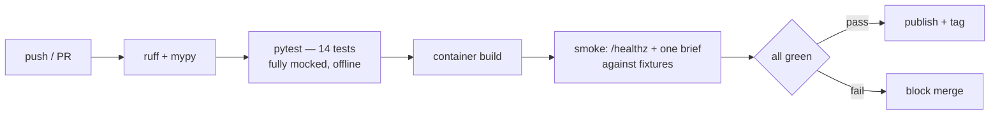

# Research Briefing Agent

**Assembles a sourced briefing from live financial sources. Measured on the surface that actually breaks agents in production: tool calls.**

<p>
  
  
  
  
</p>

> Part of a three-system architecture → [Due Diligence Agent](../due-diligence-agent/) · [Legal Intelligence Engine](../legal-intelligence-engine/) · [root README](../)

---

## The problem

Answer-quality metrics cannot see the failure that actually takes agents down. A briefing agent doesn't usually produce a *wrong* brief — it produces no brief, because a tool returned a 429, a schema drifted, or a fetch hung past the timeout. Faithfulness scores 1.00 on output that was never generated.

So this system measures a different surface from the other two. Retrieval faithfulness is the engine's problem; **tool-call reliability under real network conditions** is this one's.

---

## Results

| Metric | Value | Notes |
|---|---|---|
| **Tool-call success** | **94%** | across all tool invocations, live sources |
| **Latency p95** | **1.8s** | p95, not mean — the tail is the product |
| **Tests** | **14 passing** | external calls mocked; deterministic, no spend |

Raw runs: [`evidence/eval_runs/`](evidence/eval_runs/) · traces: LangSmith · definitions: [`../docs/METHODOLOGY.md`](../docs/METHODOLOGY.md)

**Why p95 and not average.** A mean of 0.9s hides a p99 of 14s, and the p99 is what a user experiences as broken. Reporting the tail is the difference between a metric and a claim.

**Why 94% is reported rather than fixed.** The remaining 6% is dominated by upstream rate limits and transient source failures — conditions the agent handles by degrading (fallback source, partial brief) rather than conditions it can eliminate. A retry loop tight enough to reach 99% would be indistinguishable from a scraper.

---

## Architecture

```mermaid
flowchart LR
  Q["Brief request"] --> AG["LangGraph agent"]

  AG --> T1["search"]
  AG --> T2["fetch"]
  AG --> T3["extract"]

  T1 --> CK{"tool ok?"}
  T2 --> CK
  T3 --> CK

  CK -->|"ok"| POOL["Source pool"]
  CK -->|"429 / timeout"| BO["backoff<br/>+ fallback source"]
  BO --> AG
  CK -->|"exhausted"| DEG["degrade:<br/>partial brief"]

  POOL --> SYN["Synthesise<br/>+ attribute"]
  DEG --> SYN
  SYN --> OUT["Brief + sources"]
  SYN -.-> TR[("LangSmith trace")]

  style DEG fill:#3a2a1a,stroke:#B8943F
  style CK fill:#15294a,stroke:#D8B25C
```



Every path terminates. There is no branch where the agent loops until the budget dies — degradation is an outcome with its own status, and it is the design's whole point.

---

## Response contract

| `status` | Condition | Caller should |
|---|---|---|
| `complete` | all planned tools succeeded | use the brief |
| `degraded` | ≥1 tool exhausted retries; brief built from what returned | use it, show the missing-source list |
| `failed` | insufficient sources to brief at all | do not synthesise; return the diagnostic |

`degraded` returning a usable brief with a visible gap list is the behaviour that makes 94% acceptable rather than alarming.

### Sample output

```json
{
  "status": "degraded",
  "brief": {
    "summary": "⟨synthesised brief⟩",
    "points": [
      { "text": "⟨claim⟩", "source": "https://…", "retrieved_at": "2026-08-07T09:14:22Z" }
    ]
  },
  "sources": { "requested": 6, "returned": 5, "failed": ["⟨source⟩: 429 after 3 retries"] },
  "tool_calls": { "attempted": 11, "succeeded": 10, "retried": 2 },
  "latency_ms": { "p50": 720, "p95": 1800 },
  "trace_url": "⟨langsmith-url⟩",
  "run_id": "⟨uuid⟩"
}
```

`tool_calls` is emitted on every response, not only on failure. The reliability number in this README is the aggregate of that field across the evaluation runs — the metric and the telemetry are the same object.

---

## Design decisions

Full records in [`adr/`](adr/).

**ADR-001 — Measure tool-call success, not answer quality.**
*Alternatives:* RAGAS faithfulness on the brief; human rating; nothing.
*Chose:* tool-call success rate and latency percentiles as the headline.
*Because:* this system's distinct failure mode is operational, not epistemic. Faithfulness is already measured where it belongs — in the engine. Measuring it again here would duplicate a number instead of covering a surface.
*Cost:* brief *quality* is under-measured. Named as a limitation rather than papered over.

**ADR-002 — Degrade rather than retry to exhaustion.**
*Alternatives:* unbounded retry; hard fail on first error.
*Chose:* bounded backoff → fallback source → partial brief with a gap list.
*Because:* an agent that retries until the budget dies is worse than one that returns five of six sources and says so. Bounded degradation is the difference between a demo and a service.
*Cost:* `degraded` is a common outcome; callers must handle three statuses, not one.

**ADR-003 — Mock every external call in the test suite.**
*Alternatives:* live integration tests; VCR cassettes; no tests.
*Chose:* full mocking, 14 deterministic tests.
*Because:* a suite that hits live sources fails on someone else's outage and costs money per run. CI must be free, offline, and deterministic or it gets disabled.
*Cost:* real integration is verified in the evaluation runs, not in CI.

---

## Run it

```bash
git clone https://github.com/SaraDHimdi/ai-engineer-portfolio
cd ai-engineer-portfolio/research-briefing-agent

python -m venv .venv && source .venv/bin/activate
pip install -r requirements.txt
cp .env.example .env

python -m src.brief "⟨topic or counterparty⟩"
```

As a service:

```bash
docker compose up                    # FastAPI + tracing
curl -X POST localhost:8000/brief -d '{"topic": "⟨topic⟩"}'
```

`GET /healthz` · `GET /metrics` · OpenAPI at `/docs`

---

## Reproduce the numbers

```bash
pytest                                   # 14 tests, all external calls mocked
python -m src.evaluate --config all      # writes evidence/eval_runs/<date>/
python -m src.evaluate --config reliability   # the 94% / p95 figures
```

The reliability run exercises live sources and records every tool call with its outcome and latency. Because it depends on third-party availability, results vary between runs — which is the honest characterisation of the metric, and why the stored runs are dated.

**Data.** Public financial news sources; no licensed feeds. Source list and the fixed topic set: [`evidence/sources.yaml`](evidence/sources.yaml).

---

## Operating envelope

| Sources / brief | Tool calls | p95 | Notes |
|---|---|---|---|
| ~6 | ~11 | **1.8s** | **measured** — current benchmark |
| ~20 | ⟨…⟩ | ⟨…⟩ | fan-out parallelises; synthesis context grows |
| ~50 | not measured | not measured | expect context assembly, not fetching, to bind first |

Fetch and extract are concurrent at ⟨concurrency⟩; synthesis is serial and dominates the tail. Rate limits, not compute, are the practical ceiling.

---

## Failure modes

Reproductions in [`evidence/failure_analysis.md`](evidence/failure_analysis.md).

| Failure | Cause | Mitigation | Residual risk |
|---|---|---|---|
| Rate limit (429) | upstream throttling | bounded backoff → fallback source | part of the 6%; not eliminable |
| Timeout / hang | slow or dead source | per-tool deadline, then degrade | brief loses that source |
| Schema drift | source changed its shape | extraction validated; failure is loud | silent partial extraction is the dangerous variant |
| Stale content | source cached upstream | `retrieved_at` on every point | freshness surfaced, not guaranteed |
| Brief quality | under-measured by design | — | **the acknowledged gap in this system** |

---

## CI/CD



CI never touches a live source: free to run, deterministic, and it fails for reasons in this repository rather than someone else's outage.

---

## Stack

**Orchestration** LangChain · LangGraph · LangSmith · MCP
**Evaluation** RAGAS · DeepEval · Guardrails AI
**Production** FastAPI · Docker · GitHub Actions · pytest · Helicone

---

## Roadmap

1. **Measure brief quality**, the acknowledged gap — a rubric or a gold set, so this system has an epistemic metric alongside its operational one.
2. **Push past 94%** with source-level circuit breakers rather than more retries.
3. **Expose as an MCP server**, so the Due Diligence Agent calls it the same way it calls the engine — one protocol across the architecture.
4. **Scope 2 — French and Arabic sources**, currently English-only like the rest of the stack. → [`../docs/SCOPE-2-ARABIC-FRENCH.md`](../docs/SCOPE-2-ARABIC-FRENCH.md)

---

**Demo:** ⟨link⟩ · MIT licensed
*Built with intention. Measured before it ships.*
