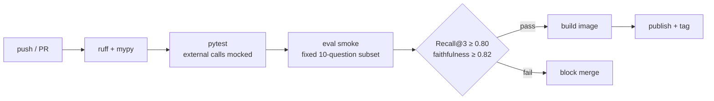

# Legal Intelligence Engine

**Retrieval core for legal corpora. Answers clause-level questions with the source span attached, or abstains.**
Exposed as an MCP server so other systems call it instead of reimplementing retrieval.

<p>
  
  
  
  
</p>

> Part of a three-system architecture → [Due Diligence Agent](../due-diligence-agent/) · [Research Briefing Agent](../research-briefing-agent/) · [root README](../)

---

## The problem

Contract language defeats generic embeddings. "Either party may terminate for convenience" and "Neither party may terminate for convenience" are near-identical in vector space and opposite in law. A retriever tuned on web text puts both in the top-3 and the generator picks one. The answer is fluent, confident, and wrong — and nothing in the pipeline notices.

This engine is the retrieval half of that problem, treated as its own measurable surface.

---

## Results

| Metric | Baseline | Tuned | Corpus | n |
|---|---|---|---|---|
| Recall@3 | 0.71 | **0.83** | CUAD + EDGAR + EUR-Lex | ⟨n⟩ |
| Faithfulness (RAG) | — | **0.84** | CUAD | 40 |
| Faithfulness (LoRA r8) | — | 0.81 | CUAD | 40 |
| Cost / query | — | **~€0.002** | — | — |

Raw runs: [`evidence/eval_runs/`](evidence/eval_runs/) · per-metric definitions: [`../docs/METHODOLOGY.md`](../docs/METHODOLOGY.md)

### The negative result, stated plainly

A rank-8 LoRA on the generation side scored **0.81 faithfulness against plain RAG's 0.84 at n = 40**. That gap is inside the noise floor for this sample size — the honest reading is *no measurable difference*, not *RAG won*.

RAG shipped, at roughly a quarter of the inference cost.

This is the load-bearing finding of the whole system. Generation was already near its ceiling on this corpus, so spending on the generator was spending in the wrong place. That is what redirected the work to retrieval, where Recall@3 then moved 0.71 → 0.83. The improvement exists *because* the null result was taken seriously instead of retried until it passed.

---

## Architecture

```mermaid
flowchart LR
  subgraph ingest["Ingest — offline"]
    A["Corpus<br/>CUAD · EDGAR · EUR-Lex"] --> B["Clause-aware<br/>chunker"]
    B --> C["Domain-adapted<br/>embedder"]
    C --> D[("Vector store<br/>Chroma / Pinecone")]
  end

  subgraph query["Query — online"]
    Q["Question"] --> R["Retrieve top-k"]
    D --> R
    R --> RR["Rerank"]
    RR --> G["Generate<br/>+ bind citations"]
    G --> V{"Every claim<br/>bound to a span?"}
    V -->|yes| OK["grounded"]
    V -->|no| AB["insufficient_evidence"]
  end

  OK --> M["MCP server"]
  AB --> M
  M --> X["Due Diligence Agent"]

  style AB fill:#3a2a1a,stroke:#B8943F
  style OK fill:#15294a,stroke:#D8B25C
```



The abstention path is not an error branch. It is a first-class output with equal standing to a grounded answer — see the response contract below.

---

## Response contract

Every call returns exactly one category. Callers branch on `status`, never on prose.

| `status` | Condition | Caller should |
|---|---|---|
| `grounded` | ≥1 span clears the similarity threshold **and** every generated claim binds to a span | use the answer, render the spans |
| `insufficient_evidence` | retrieval returned nothing above threshold | surface "not in this corpus", not a guess |
| `ambiguous_scope` | question matches spans in >1 document with conflicting terms | ask the user which instrument applies |
| `out_of_corpus` | no lexical or semantic overlap; rejected pre-generation | reject without spending a generation call |

Rejecting `out_of_corpus` before generation is a cost decision as much as a safety one — it removes the most common source of confident nonsense and the tokens that would have produced it.

### Sample output

```json
{
  "status": "grounded",
  "answer": "Either party may terminate for convenience on 30 days' written notice.",
  "spans": [
    {
      "doc_id": "CUAD/NDA_v3",
      "page": 4,
      "char_start": 1182,
      "char_end": 1317,
      "text": "Either party may terminate this Agreement for convenience upon thirty (30) days' prior written notice.",
      "score": 0.87
    }
  ],
  "retrieval": { "k": 8, "reranked_to": 3, "embedder": "⟨model-id⟩" },
  "cost_eur": 0.002,
  "latency_ms": { "retrieve": 41, "rerank": 68, "generate": 612 },
  "run_id": "⟨uuid⟩"
}
```

`run_id` resolves to a stored trace. Any answer this system has ever given can be reconstructed from it — which is what makes a published number auditable rather than merely stated.

---

## Design decisions

Full records in [`adr/`](adr/). The three that shaped the system:

**ADR-001 — Domain-adapted embeddings over a larger generator.**
*Alternatives:* bigger base model; LoRA on generation; off-the-shelf legal embeddings.
*Chose:* contrastive fine-tuning with hard negative mining on clause pairs.
*Because:* the LoRA experiment showed generation was not the bottleneck. Hard negatives are mined from clause pairs that are lexically near-identical and semantically opposite — exactly the failure this corpus produces. Recall@3 0.71 → 0.83.
*Cost:* the embedder is now corpus-specific and must be retrained for a new legal domain. Accepted; the niche is the strategy.

**ADR-002 — Clause-aware chunking over fixed windows.**
*Alternatives:* fixed 512-token windows; recursive character splitting; whole-document.
*Chose:* split on clause boundaries, keep the parent heading in each chunk's metadata.
*Because:* a clause cut in half retrieves as two weak partial matches instead of one strong exact one, and the citation span becomes unquotable.
*Cost:* depends on structural parsing, which is the acknowledged weak link upstream.

**ADR-003 — MCP server rather than an importable library.**
*Alternatives:* Python package; REST API; duplicate the retrieval in each consumer.
*Chose:* Model Context Protocol server.
*Because:* the Due Diligence Agent needs retrieval as a *tool an agent selects*, not a function a script calls. MCP gives one contract, one deployment, one place where the retrieval improves for every consumer at once.
*Cost:* a protocol hop, ⟨…⟩ms, on every retrieval.

---

## Run it

```bash
git clone https://github.com/SaraDHimdi/ai-engineer-portfolio
cd ai-engineer-portfolio/legal-intelligence-engine

python -m venv .venv && source .venv/bin/activate
pip install -r requirements.txt
cp .env.example .env                      # add your API key

python -m src.ingest                      # builds the index from the sample corpus
python -m src.ask "What is the termination notice period?"
```

As an MCP server:

```bash
python -m src.mcp_server                  # stdio transport
```

```jsonc
// claude_desktop_config.json / any MCP host
{ "mcpServers": {
    "legal-intelligence": {
      "command": "python",
      "args": ["-m", "src.mcp_server"],
      "cwd": "⟨abs-path⟩/legal-intelligence-engine"
    } } }
```

Exposed tools: `retrieve_clauses` · `answer_with_citations` · `explain_retrieval`

---

## Reproduce the numbers

```bash
pytest                                    # external calls mocked; no network, no spend
python -m src.evaluate --config all       # writes evidence/eval_runs/<date>/
python -m src.evaluate --config lora_ablation   # the null result above
```

Every run writes `metrics.json`, the resolved config, the question set, and per-question traces. The LoRA comparison in this README is a **stored** run — config and raw output are in [`evidence/`](evidence/), not regenerated on demand, because the adapter is not shipped.

**Datasets.** [CUAD](https://www.atticusprojectai.org/cuad) (commercial contracts, clause-labelled) · [EDGAR](https://www.sec.gov/edgar) (SEC filings) · [EUR-Lex](https://eur-lex.europa.eu/) (EU legal corpus). All public. Evaluation questions and gold spans: [`evidence/qa_set.jsonl`](evidence/qa_set.jsonl).

---

## Operating envelope

Measured on a **2,438-document** benchmark index.

| Corpus size | Index build | Query p95 | Notes |
|---|---|---|---|
| ~50 docs | ⟨…⟩ | ⟨…⟩ | in-memory Chroma is sufficient |
| ~500 docs | ⟨…⟩ | ⟨…⟩ | persistent Chroma; reranking starts to dominate latency |
| **2,438 docs** | ⟨…⟩ | ⟨…⟩ | **measured** — current benchmark index |
| ~10k docs | not measured | not measured | Pinecone path; expect rerank batching to be the first thing to break |

Fill the measured column from `evidence/eval_runs/`; leave the unmeasured row honest.

Ingest is embarrassingly parallel and batched at ⟨batch-size⟩ chunks per embedding call. Query cost is dominated by generation, not retrieval — which is why the €0.002 figure barely moves with corpus size.

---

## Failure modes

Per-case analysis with reproductions in [`evidence/failure_analysis.md`](evidence/failure_analysis.md).

| Failure | Cause | Current mitigation | Residual risk |
|---|---|---|---|
| Antonym clause collision | near-identical wording, opposite meaning | hard negative mining targets exactly this | not eliminated; measured by Recall@3, not zero |
| Cross-document conflict | top-k cannot hold two documents in tension | `ambiguous_scope` status | the system defers to the user rather than resolving |
| Dirty text extraction | upstream parsing failure | none — benchmarks assume clean text | **the largest unaddressed risk in this repo** |
| Small evaluation set | n = 40 catches regressions, not rare modes | consolidated harness over one legal corpus | any single metric delta under ~0.05 is noise |

Stated plainly: every number here sits downstream of document parsing, and parsing is not measured. A production deployment would need that surface benchmarked before these figures transfer.

---

## CI/CD



The regression gate is the point. A retrieval change that improves latency and quietly costs 4 points of Recall@3 does not merge. Thresholds live in [`.github/workflows/eval.yml`](../.github/workflows/eval.yml) and are versioned with the code.

---

## Stack

**Retrieval** Chroma · Pinecone · Sentence Transformers · contrastive learning with hard negatives
**Orchestration** LangChain · LangSmith · MCP
**Evaluation** RAGAS · DeepEval · Guardrails AI
**Fine-tuning** HuggingFace PEFT · LoRA · bitsandbytes · TRL
**Production** FastAPI · Docker · GitHub Actions · pytest · Helicone

---

## Roadmap

1. **Parsing benchmark.** The acknowledged weak link, currently unmeasured. Everything else is downstream of it.
2. **Grow the evaluation set** past n = 40 on the consolidated legal corpus, so deltas under 0.05 become readable.
3. **Cross-document reasoning** beyond top-k — hold two instruments in tension rather than returning `ambiguous_scope`.
4. **Scope 2 — French and Arabic.** Every number above is measured on **English** corpora. The civil-law positioning is a claim, not a demonstration. The programme that closes it: a text-layer inventory of the Bulletin Officiel archive, a five-system Arabic OCR comparison on hand-verified pages, and a **public French/Arabic legal retrieval benchmark verified by a jurist**. No such benchmark exists today. → [`../docs/SCOPE-2-ARABIC-FRENCH.md`](../docs/SCOPE-2-ARABIC-FRENCH.md)

---

**Demo:** ⟨link⟩ · **Models:** ⟨link⟩ · MIT licensed
*Built with intention. Measured before it ships.*
